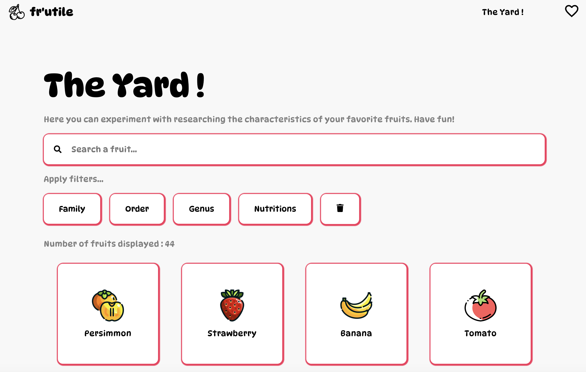
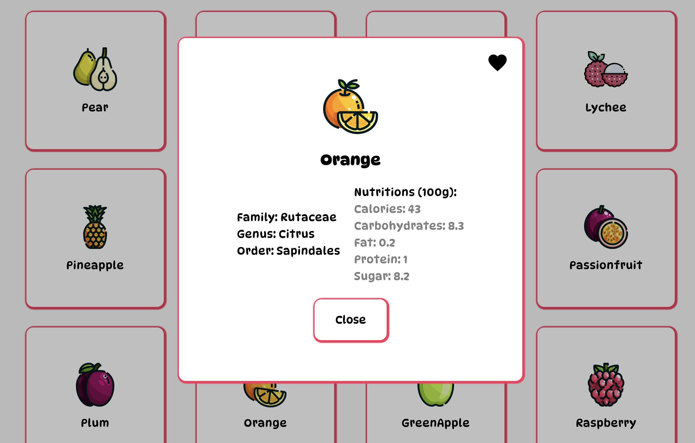
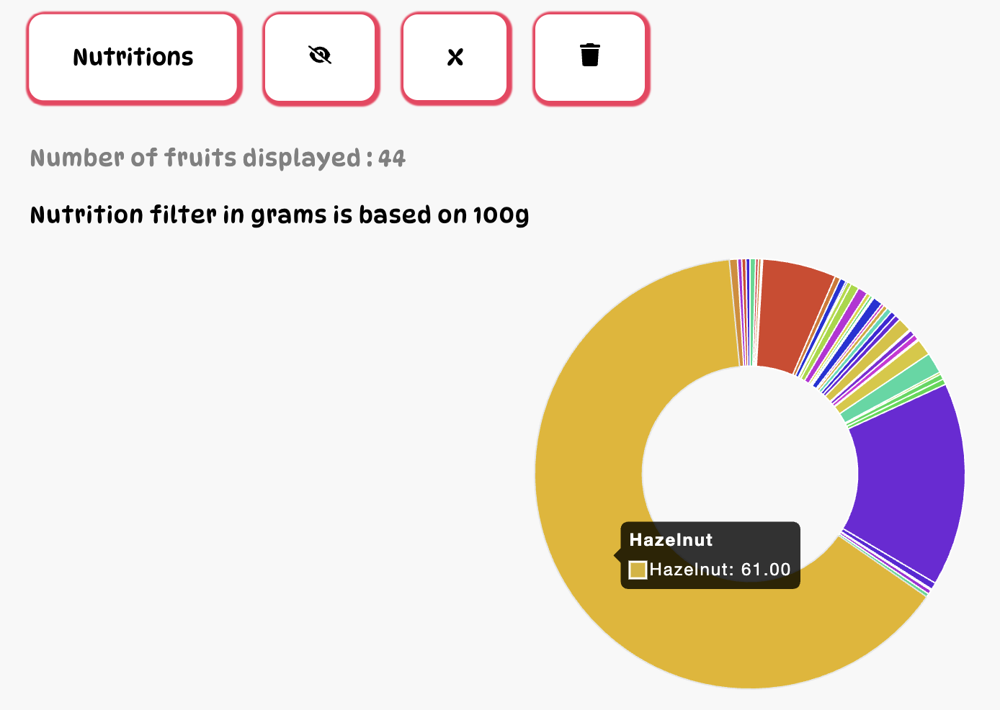

# 🍒 fr'utile

**fr'utile** is a web application developed with ReactJS as part of the Web Programming course in S4 - IMAC.

---

## 📍 Features

The website is connected to a public API called [Fruityvice](https://www.fruityvice.com/).  
The goal of the project is to offer a set of filters that users can use to search for a specific fruit, a category, and also compare fruits using a more advanced data visualization system — especially in terms of nutritional filtering.

---

## 🖼️ Screenshots

  
  
  

